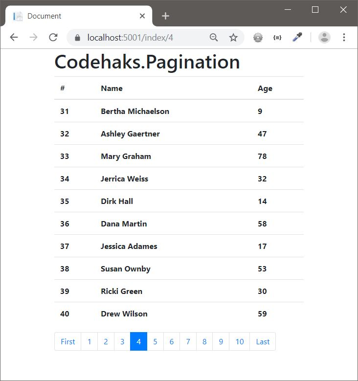

# Codehaks.Pagination

A Bootstrap-styled pagination **Tag Helper** and lightweight paging helpers for ASP.NET Core.



## Requirements

- .NET 10 / ASP.NET Core
- Bootstrap 4+ (for the `pagination` / `page-item` / `page-link` styles)

## Install

```sh
dotnet add package Codehaks.Pagination
```

Then register the tag helper in `_ViewImports.cshtml`:

```cshtml
@addTagHelper *, Codehaks.Pagination
```

## Usage

### 1. Page your data (server side)

The library adds two `IQueryable<T>` helpers:

```csharp
using Codehaks.Pagination;

// Compose into an existing query (EF Core materializes it):
var users = await db.Users
    .OrderBy(u => u.Id)
    .Page(pageNumber, pageSize)   // Skip/Take
    .ToListAsync(ct);

// Or get a page plus metadata in one call:
PagedResult<User> page = db.Users.OrderBy(u => u.Id).ToPagedResult(pageNumber, pageSize);
// page.Items, page.TotalCount, page.TotalPages, page.HasNextPage, page.HasPreviousPage
```

Both throw `ArgumentOutOfRangeException` for a page number below 1 or a non-positive page size.

### 2. Render the control (Razor view)

```cshtml
<pagination page-count="@Model.TotalPages"
            page-target="/index"
            page-number="@Model.PageNumber"
            page-range="5">
</pagination>
```

### Tag Helper attributes

| Attribute      | Type   | Description                                                             | Default |
|----------------|--------|-------------------------------------------------------------------------|---------|
| `page-count`   | int    | Total number of pages (from your server-side code).                     | —       |
| `page-number`  | int    | The current (1-based) page.                                             | —       |
| `page-target`  | string | URL base each page link points at, e.g. `/index` → `/index/3`.          | —       |
| `page-range`   | int    | How many page links to show around the current page.                    | 5       |
| `page-size`    | int    | Items per page (used for defaulting).                                   | 10      |
| `page-first`   | string | Label for the first-page link (e.g. localize to `اول`).                 | `First` |
| `page-last`    | string | Label for the last-page link (e.g. localize to `آخر`).                  | `Last`  |

It renders a `<nav><ul class="pagination">…</ul></nav>` with a `First` link, a window of
numbered page links (the current one marked `active`), and a `Last` link.

## Sample project

A runnable Razor Pages sample lives in
[`src/Codehaks.Pagination.Sample`](src/Codehaks.Pagination.Sample). It uses a throwaway SQLite
database that is created and seeded on first run, so you can just:

```sh
dotnet run --project src/Codehaks.Pagination.Sample
```

## Building & testing

```sh
dotnet build
dotnet test
```

## Bugs & issues

Please report any bugs or issues on the
[issue tracker](https://github.com/Codehaks/Pagination/issues).

## License

MIT
